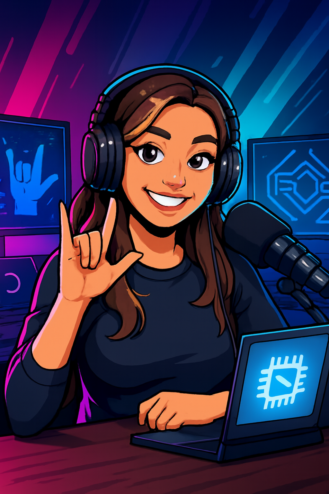

  

  
  

  🎧 Preview do podcast

  <audio src="output/podcast_editado.MP3" controls title="Podcast editado"></audio>

# 🎙️ Projeto Podcast Gerado por I.A.s

> ℹ️ **NOTA:** Este é um projeto pessoal desenvolvido por Leticia utilizando ferramentas de inteligência artificial para criar um podcast completo.

## 💻 Tecnologias utilizadas

- [Gemini](https://gemini.google.com/)  
- [Copilot](https://copilot.microsoft.com/)  
- [ElevenLabs](https://beta.elevenlabs.io/)  
- [Capcut](https://www.capcut.com/pt-br/)

## ✨ Como foi feito?

- Roteiro gerado via Gemini  
- Áudio gerado pela ElevenLabs  
- Capas criadas com Copilot  
- Edição de áudio e trilha sonora via Capcut

## 📚 Materiais

- [Editor de áudio Capcut](https://www.capcut.com/editor?from_page=landing_page)

## 🛠️ Instruções de execução

- 🤖 1. Use os prompts de roteiro no Gemini  
- 🤖 2. Gere o áudio com ElevenLabs  
- 🤖 3. Crie as artes com Copilot  
- 🎬 4. Edite e finalize no Capcut

## 👩‍💻 Criadora

  
  
&nbsp;&nbsp;&nbsp;<strong>Leticia</strong> 
  &nbsp;&nbsp;&nbsp;
  <a href="https://github.com/Ledejesus">GitHub</a>
  &nbsp;|&nbsp;
  <a href="linkedin.com/in/leticia-de-jesus-23b808249/">LinkedIn</a>
  &nbsp;|&nbsp;
  

  

---

⌨️ com 💜 por [Leticia](https://github.com/Ledejesus)